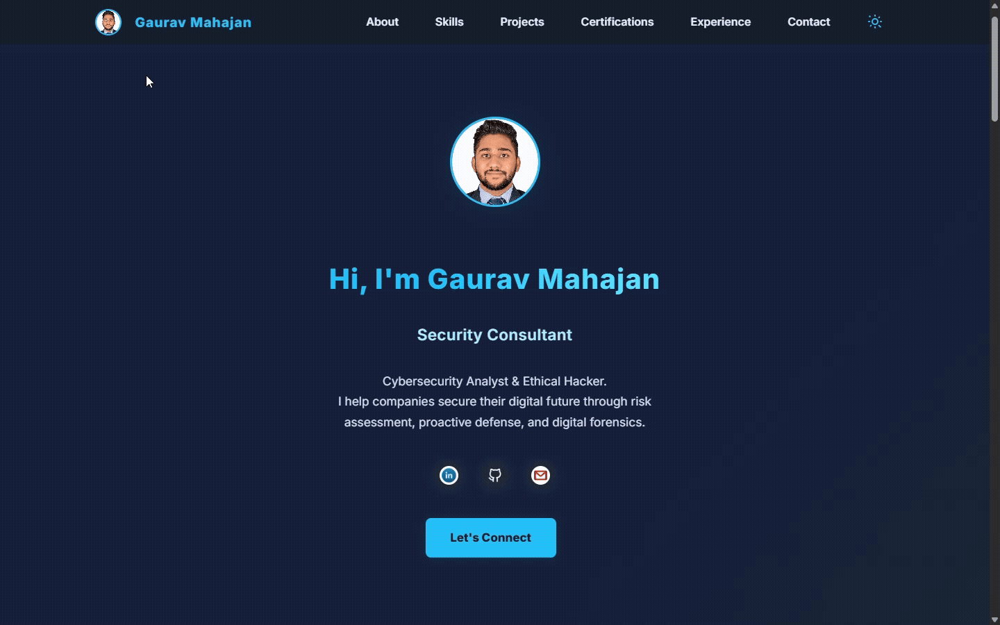
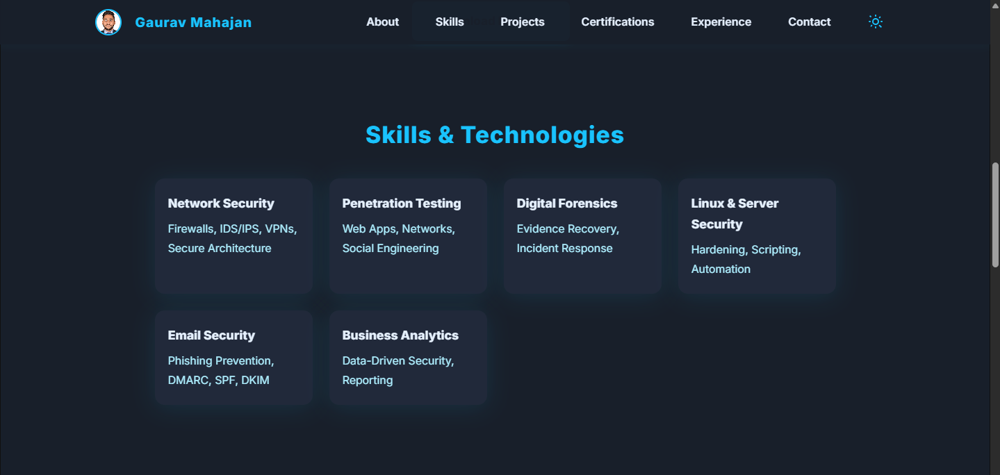
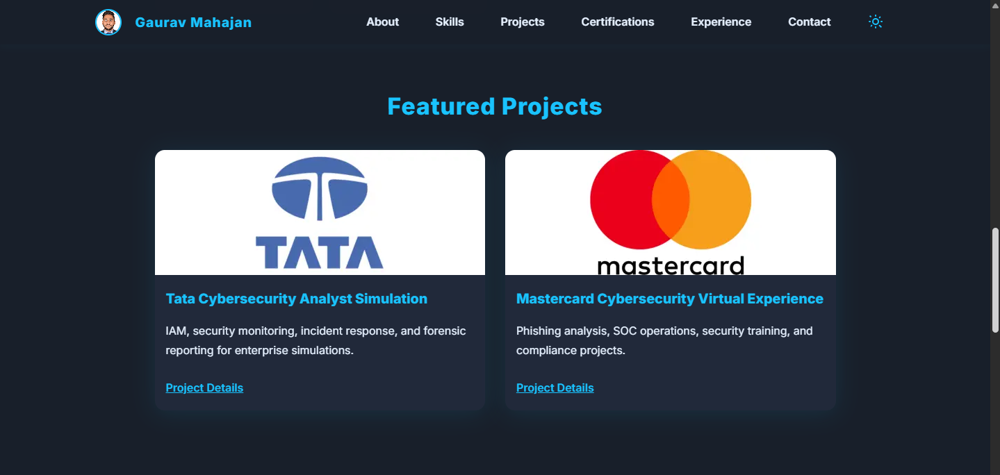

# Personal Portfolio 🔥
> https://gauravmahajan.tech/

:star: Star me on GitHub — it helps!

### Website Preview

#### Home Page
<!-- Replace with your GIF or screenshot when available -->

#### Skills & Technologies Section
<!-- Replace with your image when available -->

#### Projects Section
<!-- Replace with your image when available -->

:star: Star me on GitHub — it helps!

## About 👨‍💻
Cybersecurity Analyst specializing in penetration testing, digital forensics, and risk management. Bridging technology and business for secure solutions.

## Features 📋
⚡️ Built with HTML5, CSS3, and JavaScript
⚡️ Fully Responsive Design
⚡️ SEO Optimization (Open Graph, JSON-LD)
⚡️ Dark/Light Mode Toggle
⚡️ Accessible Design (ARIA support)

## Installation & Deployment 📦
- Clone the repository and modify the content as you need.
- Add or update images in the `website_images/` or `assets/img/` directory.
- Update the info for each section according to your portfolio.
- Use [GitHub Pages](https://create-react-app.dev/docs/deployment/#github-pages) or your custom domain to create your own website.
- To deploy your website on GitHub Pages, create a repository named `<your-github-username>.github.io` and push the generated code to the `main` branch.

## Sections 📚
✔️ Hero (Introduction)
✔️ About Me
✔️ Skills & Technologies
✔️ Projects
✔️ Certifications
✔️ Experience
✔️ Contact

## Tools Used 🛠️
* <b>GitHub Pages</b> - To host my static website (HTML, CSS, JS).

## Social & Contact 🌐
- [LinkedIn](https://linkedin.com/in/gaurav-mahajan-1155561b1/)
- [GitHub](https://github.com/Gaurav-S-Mahajan)
- Email: gauravmofficial99@gmail.com

## Contributing 💡
#### Step 1

- **Option 1**
    - 🍴 Fork this repo!

- **Option 2**
    - 👯 Clone this repo to your local machine.

#### Step 2

- **Build your code** 🔨🔨🔨

#### Step 3

- 🔃 Create a new pull request.

## License

- **[MIT license](LICENSE)**

---

> _Feel free to connect on [LinkedIn](https://linkedin.com/in/gaurav-mahajan-1155561b1/) or star this repo if you found it helpful!_
